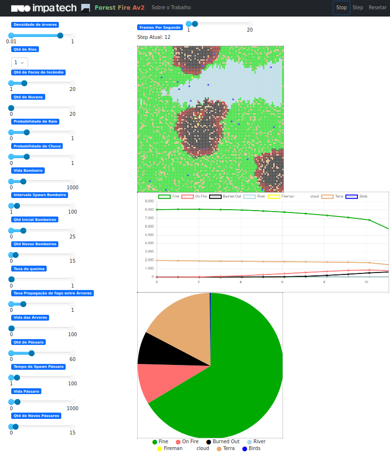

# Forest Fire AV2

Forest Fire AV2 é um simulador [Python](https://www.python.org/) de incêndios florestais em um ambiente bidimensional, sendo mais dinâmico, flexível e enriquecido que implementações mais rudimentares do modelo. A liberdade na escolha de parâmetros permite ao usuário uma abordagem mais detalhada e lúdica da simulação, permitindo uma análise visual em tempo real do comportamento do fogo. Os requisitos para o uso do modelo são apenas a [Livraria Original do Python](https://docs.python.org/3/library/) e o [Framework Mesa](https://mesa.readthedocs.io/stable/).

### Download

Faça o download da versão mais recente por meio do [Repositório GitHub do Projeto](https://github.com/viniciusgma/AV2.git). 

### Executar

Dentro da pasta AV2 executar comando `mesa runserver`

### Set up

Depois de criar um env e executar `pip install -r requirements.txt` :

`pre-commit install`

`pre-commit run --all-files`

Ao executar pre-commit install, sempre, antes de um commit ser confirmado, serão executados os tests, um linter e um formatador, e o commit só passará se todos retornarem "passed".

## Utilização

Na janela do simulador o usuário tem acesso a vários parâmetros referentes aos diversos agentes do modelo, sendo eles agentes inertes (terra, árvore e água), agentes móveis (bombeiro, nuvem e pássaro) ou agentes virtuais (fogo). Todos os parâmetros são ajustáveis, e as variadas configurações geram dinâmicas particulares.

